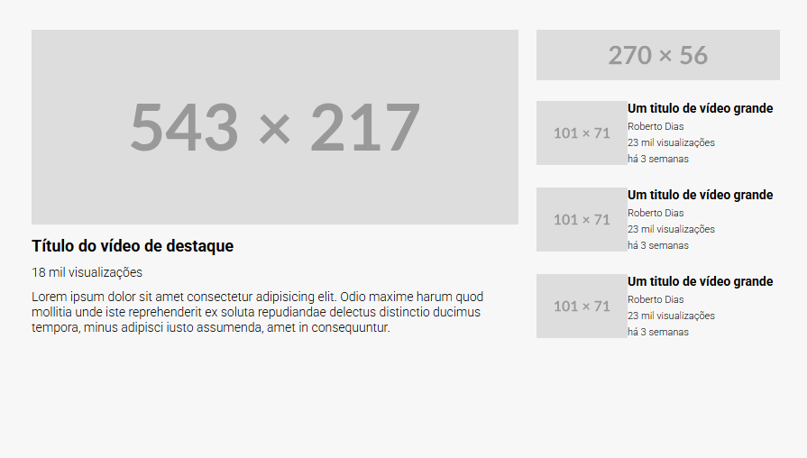

# Layout de Vídeo em Grid 🎥

Este projeto é uma demonstração simples e eficaz de como criar um layout de página de vídeo, semelhante a plataformas de streaming populares, usando **CSS Grid**. Ele apresenta uma área principal para o "vídeo em destaque" e uma barra lateral (*sidebar*) contendo uma propaganda e uma lista de vídeos sugeridos.

## ✨ Pré-visualização




## 🚀 Funcionalidades

* **Layout Baseado em CSS Grid**: A estrutura principal é construída com a poderosa propriedade `display: grid`, garantindo um layout limpo e fácil de gerenciar.
* **HTML Semântico**: A estrutura é organizada com tags HTML5 claras e compreensíveis.
* **Estrutura Componentizada**: O layout é dividido em uma seção de vídeo em destaque e uma barra lateral para os próximos vídeos.
* **Fontes Personalizadas**: Utiliza a fonte "Roboto" do Google Fonts para uma melhor tipografia.
* **Estilização Básica**: Inclui um `reset.css` para consistência entre navegadores e uma estilização limpa para todos os elementos.

---

## 💻 Tecnologias Utilizadas

* **HTML5**: Para a estrutura e conteúdo da página.
* **CSS3**: Para estilização e layout, com foco em:
    * **CSS Grid**: Para o layout principal da página.
    * **Flexbox**: Para alinhar itens dentro da lista de vídeos.
* **Google Fonts**: Para importar a família de fontes "Roboto".

---

## 📂 Estrutura de Arquivos

O projeto está organizado da seguinte forma para separar a estrutura (HTML) da estilização (CSS).

```
nome-do-projeto/
├── index.html
└── src/
    └── css/
        ├── reset.css
        └── style.css
```

* `index.html`: Arquivo principal que contém toda a estrutura do conteúdo da página.
* `src/css/reset.css`: Folha de estilo para zerar os estilos padrão do navegador, garantindo consistência visual.
* `src/css/style.css`: Folha de estilo principal onde toda a estilização e o layout em grid são definidos.

---

## 🧠 Conceito Principal: Implementação do CSS Grid

O núcleo deste layout é a classe `.container`, que funciona como o contêiner do grid.

```css
.container {
    max-width: 900px;
    background-color: #F7F7F7;
    display: grid;
    grid-template-areas: "featured-video ad-propaganda"
                         "featured-video video-list";
    grid-template-columns: 1fr 270px;
    grid-template-rows: 56px 1fr;
    gap: 2rem;
    padding: 3.5rem;
}
```

* `display: grid`: Esta declaração transforma o elemento `.container` em um contêiner grid.
* `grid-template-areas`: Esta é a parte mais intuitiva. Ela cria uma representação visual do nosso layout.
* `grid-template-columns`: Define a largura das colunas. A primeira coluna (`1fr`) ocupa o espaço fracional restante, enquanto a segunda coluna tem uma largura fixa de `270px`.
* `grid-template-rows`: Define a altura das linhas. A primeira linha (para a propaganda) tem uma altura fixa de `56px`, e a segunda linha (`1fr`) ocupa o espaço restante.

---

## 🔧 Como Começar

Para visualizar ou usar este projeto, siga estes passos simples:

1.  **Clone o repositório:**
    ```bash
    git clone [https://github.com/seu-usuario/seu-repositorio.git](https://github.com/seu-usuario/seu-repositorio.git)
    ```
2.  **Navegue até o diretório do projeto:**
    ```bash
    cd nome-do-diretorio
    ```
3.  **Abra o arquivo `index.html`** no seu navegador de preferência. E pronto!
